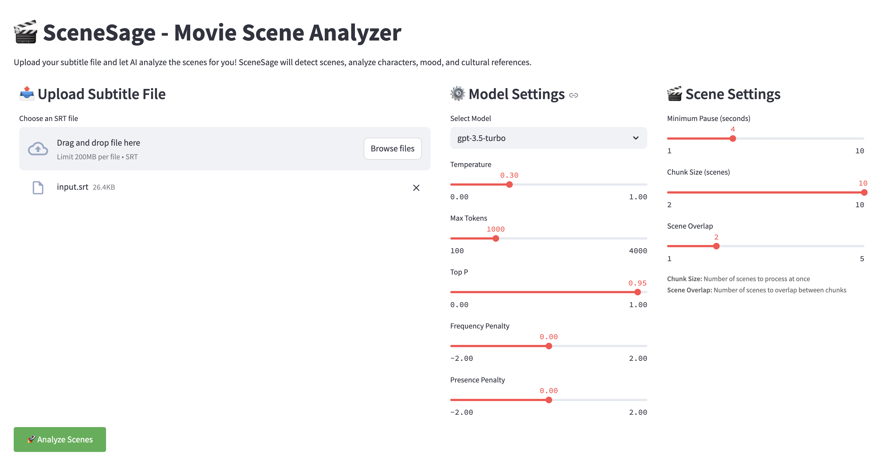
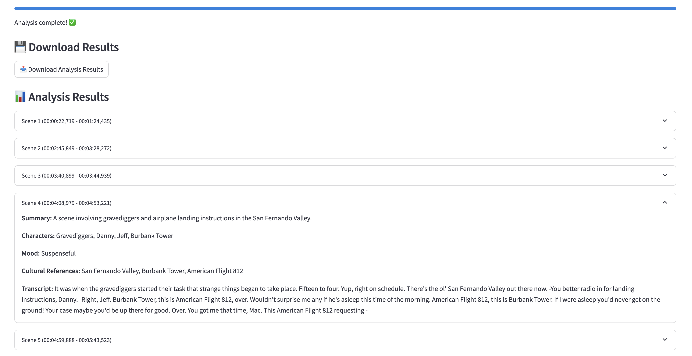

# 🎬 SceneSage - AI-Powered Film Scene Analyzer

> Transform your film subtitles into rich, structured scene annotations using the power of Large Language Models.

[](https://www.python.org/downloads/)
[](https://opensource.org/licenses/MIT)
[](https://www.docker.com/)

## ✨ Features

- 🎯 **Smart Scene Detection**: Automatically identifies scene boundaries using dialogue pauses
- 🤖 **Multi-Model Support**: Choose between OpenAI GPT and Google Gemini models
- 📊 **Rich Scene Analysis**:
  - Concise scene summaries
  - Character identification
  - Emotional tone analysis
  - Cultural reference detection
- 🚀 **Performance Optimized**:
  - Intelligent text chunking for efficient processing
  - Parallel request handling for faster results
  - Memory-efficient processing of large files
- 💻 **Multiple Interfaces**:
  - Command-line tool for automation
  - Web interface for interactive use
- 🐳 **Docker Support**: Ready-to-use containerized environment

## 🛠️ Technologies

- **Core**: Python 3.8+
- **LLM Backends**:
  - OpenAI GPT (3.5-turbo, 4)
  - Google Gemini
- **Web Interface**: Streamlit
- **Containerization**: Docker
- **Performance**: AsyncIO for parallel processing

## 🚀 Quick Start

### Prerequisites

- Python 3.8 or higher
- OpenAI API key (for GPT models)
- Google API key (for Gemini)

### Installation

1. Clone and setup:

```bash
git clone <repository-url>
cd scenesage
python -m venv venv
source venv/bin/activate  # Windows: venv\Scripts\activate
pip install -r requirements.txt
```

2. Configure API keys in `.env`:

```env
OPENAI_API_KEY=your-openai-api-key-here
GOOGLE_API_KEY=your-google-api-key-here
```

## 💻 Usage

### Command Line Interface

```bash
# Basic usage
python scenesage.py input.srt

# Advanced options
python scenesage.py input.srt --output scenes.json --model gpt-4 --min-pause 5
```

#### Command-line Arguments

| Argument       | Description                                | Default       |
| -------------- | ------------------------------------------ | ------------- |
| `input_file`   | Input SRT file path                        | Required      |
| `--output`     | Output JSON file path                      | scenes.json   |
| `--model`      | LLM model to use                           | gpt-3.5-turbo |
| `--min-pause`  | Minimum pause duration (seconds)           | 4             |
| `--chunk-size` | Number of scenes per API request           | 5             |
| `--overlap`    | Number of scenes to overlap between chunks | 1             |

### Web Interface

```bash
streamlit run app.py
```

The web interface provides a responsive design that works seamlessly on both desktop and mobile devices:




Features:

- 📱 **Mobile-First Design**: Optimized for all screen sizes
- 📤 **Easy File Upload**: Drag-and-drop or file browser support
- ⚙️ **Model Selection**: Choose between different LLM backends
- 📊 **Real-time Progress**: Track analysis status
- 💾 **JSON Export**: Download results in structured format

## 🔧 Performance Optimizations

SceneSage implements several performance optimizations to handle large subtitle files efficiently:

### Text Chunking

- Intelligent scene segmentation based on dialogue pauses
- Configurable chunk sizes (default: 5 scenes per chunk)
- Scene overlap between chunks (default: 1 scene) to maintain context
- Optimal chunk sizes for LLM processing
- Context preservation across chunks

### Parallel Processing

- Concurrent API requests for faster analysis
- Rate limiting to respect API quotas
- Efficient resource utilization
- Configurable chunk size and overlap for optimal performance

## 🐳 Docker Deployment

### Quick Start

```bash
# Build image
docker build -t scenesage .

# Run web interface
docker run -p 8501:8501 --env-file .env scenesage

# Run CLI
docker run --env-file .env -v $(pwd):/app scenesage python scenesage.py input.srt
```

### Docker Commands

| Command           | Description                |
| ----------------- | -------------------------- |
| `-p 8501:8501`    | Map container port to host |
| `--env-file .env` | Load environment variables |
| `-v $(pwd):/app`  | Mount current directory    |

## 📝 Example Output

```json
[
  {
    "start": "00:00:22,719",
    "end": "00:00:31,507",
    "transcript": "Greetings, my friend. We are all interested in the future...",
    "summary": "The narrator reflects on humanity's fascination with the future.",
    "characters": ["Narrator"],
    "mood": "dramatic",
    "cultural_refs": []
  }
]
```

## 🔍 Troubleshooting

### Common Issues

1. **Port Conflicts**

```bash
# Use alternative port
docker run -p 8502:8501 --env-file .env scenesage
```

2. **Permission Issues**

```bash
chmod -R 777 .
```

3. **Container Cleanup**

```bash
docker container prune
docker image prune
```

## 📄 License

MIT License - See [LICENSE](LICENSE) for details.

---

<div align="center">
Made with ❤️ by Afshin Zanganeh
</div>
